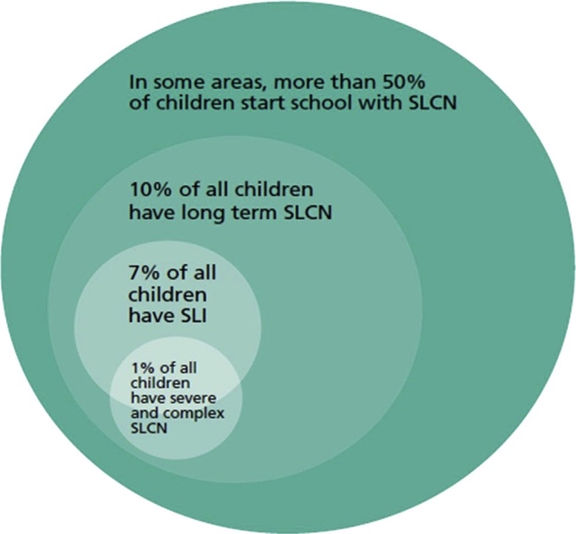
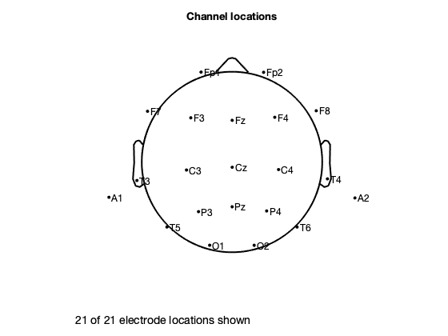
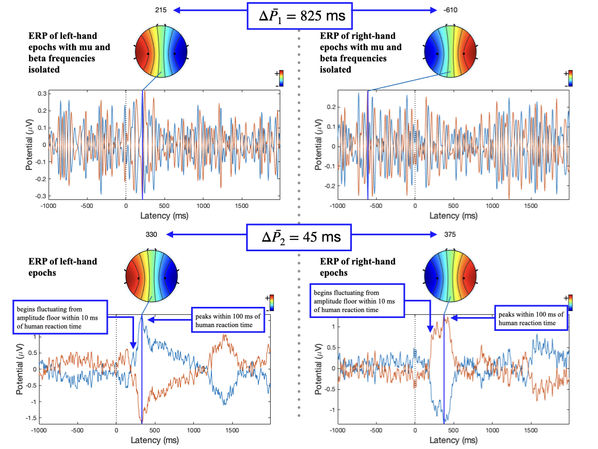
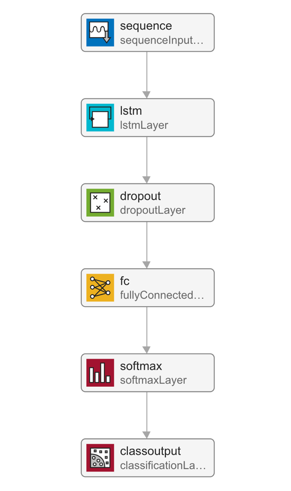

# Prospects of brain-computer interfaces in communication for disabled children

Tahmid Azam

May 2022

All figures, except for Figure 1, were either programmatically generated
using MATLAB and EEGLAB, created in Adobe Photoshop, or plotted in
Microsoft Excel for this study. All scripts and functions for both the
generation of figures and the research are original and were written for
this study.

This project is dedicated to my brother, Tahsin.

**Abstract**

Communication is a pillar of societal interaction for humans, pivotal
from an early age. An incapacity to communicate is a universal
obstruction to a child's social and emotional development. This project
aims to explore the impacts of speech, language, and communication
needs, and how an augmentative and alternative communication system,
specifically a brain-computer interface, can lessen them. Consumer
electroencephalography systems for recording electrical activity in the
brain are becoming more affordable. Additionally, the number of large
datasets available is increasing, enabling neural networks to become a
prospective option for motor imagery classification. Moreover, the high
mobile computing performance and power efficiency of today's devices can
host these neural network classifiers. Both brain imaging and
classification are integral to the workings of a brain-computer
interface. The results of this project find that a unidirectional, long
short-term memory, recurrent neural network can classify left- and
right- hand imageries to an accuracy of 91.95%, demonstrating their high
capability.

# Introduction

Speech, language, and communication needs (SLCN) describe an individual
for whom spoken language is insufficient for supporting conversation and
peer interaction \[1\]. SLCN can arise from aphonia, verbal dyspraxia,
learning disabilities like autism spectrum disorder, congenital
conditions such as Down's syndrome, and cancers or injury to the head or
neck \[2\]. A population study found that at school entry, 2 out of 30
children will experience SLCN severe enough to affect development and
academic progress \[3\]. In addition, more primary school children have
SLCN than any other type of special educational need \[4\]. The capacity
for communication is the foundation for independence and participation
in society \[5\]; it is integral to social, emotional and educational
development \[6\] in addition to one's sense of self and cultural
identity \[5\]. To mitigate SLCN, schools often employ differentiated
curriculums and timetables that provide more focused teaching but reduce
social involvement. Limiting the time an individual has with their peers
can result in isolation, alienation, and inclusion issues in the
classroom \[1\]. These effects of SLCN carry into later life: studies
demonstrate that SLCN is associated with poor literacy, mental health
and employment outcomes \[7\]. Figure 1 reveals the prevalence of SLCN
throughout life and emphasises its dominance over early life.

{width="2.9139785651793524in"
height="2.7006846019247592in"}

[]{#_Ref104104312 .anchor}Figure 1: The prevalence of SLCN \[6\].

Augmentative and alternative communication (AAC) systems attempt to
break down the barriers constructed by SLCN. AAC strategies are diverse,
from the low-tech solutions of sign language and display boards to
high-tech electronic systems relying on speech generation \[8\]. There
are variety of these high-tech applications, from touchscreens and
keyboards to those that use eye-tracking and breath activation \[8\]. To
gain an impression of the experience of current AAC systems, I conducted
an interview for this study \[9\] with the mother of Amos, a 9-year-old
child diagnosed with Down's Syndrome and developmental verbal dyspraxia
(DVD). Down's Syndrome is a genetic condition involving the trisomy of
chromosome 21 \[10\]. Verbal dyspraxia involves an impairment of
speaking as a result of difficulties in muscle coordination \[11\]. Amos
communicates daily with Makaton sign language, which is a symbol and
sign set \[12\]; however, this method has become inadequate in recent
years as his emotional and educational needs have grown complex. Sign
language has been applicable for communication within Amos' family but
as interaction extends to his peers at his school, it becomes less
effective as many are unfamiliar with sign language. To support his
communication further, he utilises *TouchChat*, an AAC application for
tablets, which uses a matrix of on-screen buttons and a speech
generation function, enabling conversation with those around him. This
method provides a great deal of convenience but also serves as a
distraction due to additional functions of the tablet. Despite the
portable form factor, the tablet needs to be in-hand and carried
everywhere. Without his AAC, Amos is little understood and often
underestimated. The communication gap between him and his peers widens,
ultimately leading to his personal frustration.

{width="6.268055555555556in"
height="4.218055555555556in"}

[]{#_Ref104108033 .anchor}Figure 2: Flowchart comparing the pathways of
traditional and BCI AAC communication.

In the context of AAC, the brain-computer interface (BCI) allows an
individual control of a speech generating device by modulating one's
brain signals \[8\], providing a universal and non-muscular channel for
communication \[13\]. As a result, they are undetectable in body
language and require no peer training, which makes for a more seamless
experience for children like Amos. The green channel in Figure 2
demonstrates how the neuromuscular coordination of vocal cords (the red
channel) is bypassed by a BCI AAC system (the green channel). The
process begins with the intent of the user, which triggers a cascade of
complex process involving activation of many areas of the brain and the
motor pathways of the nervous system \[14\]. These activations, also
called motor imagery, are observed via electroencephalography (EEG), a
method of measuring the electrical activity in the brain \[15\]. The BCI
then picks out the relevant streams of intention amidst the sea of
electrophysiological activity by pre-processing the signal, extracting
features, and finally classifying them. Feature extraction splits the
stream into salient snippets of signals. These snippets, or epochs, are
mapped into outputs via classification, which finally control the
speech-generating device \[8\]. BCIs continuously read brain activity,
and feature extraction, signal processing and classification all must
occur in real time. Currently, BCIs are used as a last resort for AAC
systems \[14\]. They are common in patients with locked-in syndrome (a
state describing a person who is cognitively intact but paralysed,
unable to perform voluntary movement \[14\]). Amyotrophic lateral
sclerosis is an example of a locked-in condition, where initial muscle
atrophy develops to a complete loss of voluntary movement \[8\]. Life
support systems such as artificial respiration and artificial nutrition
can prolong life expectancy, but the loss of motor pathways inhibits all
forms of communication. The BCI becomes a locked-in human's only form of
interaction with the wider world. Today's brain-computer interfaces are
slow and unreliable \[13\], limiting their ability to support a wider
range of needs. This project aims to challenge these limitations.

Classification is the crux of BCIs: it is the process by which brain
activity is sorted into classes, for example the hands, legs, feet, and
tongue. Statistical classifiers, support vector machines, neural
networks and nonlinear Bayesian classifiers \[8\] are examples of
algorithms that map brain activity to classes. Neural networks are
excellent at pattern recognition; their method of learning from example
is akin to the workings of the human brain. In BCIs, they are applicable
as the defining patterns for different motor imageries are found deep in
the rhythm of multiple electrodes and behind walls of signal noise and
artefacts \[13,16,17\]. Their potential is growing as large datasets are
becoming available and mobile computing performance and power efficiency
are improving \[18\]. In this project, a neural network is trained from
a dataset of EEG recordings, \[19\], to classify left- and right-hand
imagery and then tested to assess its effectiveness.

# Electroencephalography

Electroencephalography measures the electrical activity of the brain.
When neurones transmit information between each other, current dipoles
are formed by simultaneous postsynaptic potentials \[20\]. These
potentials are measured by electrodes placed on the scalp. Current
dipoles are the configuration of intracellular current sources and
extracellular current sinks that form following the release of
neurotransmitters at the terminal boutons of axons at a synapse \[15\].
The equipment used to carry out an EEG consists of electrically
conductive electrodes, operational amplifiers, and an
analogue-to-digital converter (ADC). Amplifiers increase the amplitude
of the potentials measured by the electrodes so that the ADC can sample
at a suitably high precision. The output of an EEG system is a log of
potential difference over time between active electrodes and the
reference electrode.

EEG is chosen for BCIs as systems are relatively low-cost, portable and
have a very high time resolution when compared to other brain imaging
methods such as magnetoencephalography (MEG) and functional magnetic
resonance imaging (fMRI) \[21\]. High time resolution describes EEG's
high sample rate which allows measurements at millisecond time
intervals. The non-invasive nature removes the risk of infection from
percutaneous wires, in conjunction with issues of biocompatibility:
tissue damage and reaction to presence of electrodes inside the cranium
can cause signal loss in the long-term \[21\]. Portability results from
active electrodes which have small on-scalp amplifiers that utilise
wireless communication to transmit signals to a processing unit \[21\].
Minimising the cables in the system prevents the issues of electrode
dislocation and signal disruption from cable sway \[21\].

However, traditional EEG systems require uncomfortable electrolytic gels
or salts to be applied, which provide a conductive path between the
scalp and the electrode \[14\]. Without gels, the inconsistency in
resistance between the scalp and electrode introduces noise into the
signal. As potentials must cross from brain tissue, the skull, and the
scalp, the signal recorded at the electrode is prone to artefacts, which
can originate from cardiac and ocular activity \[15\]. The signal is
also incredibly weak, with amplitudes in the microvolts \[13\],
increasing its sensitivity to noise from external environmental
disturbances and mains oscillations further \[15\]. Extracranial EEG's
spatial resolution is poor compared to MEG, fMRI, and invasive methods
\[21\]. This can be attributed to the requirement of simultaneity of
potentials for a sufficiently large amplitude able to travel to the
scalp to be measured: each electrode's signal is affected by roughly 100
million and 1 billion neurons \[15,22\]. This low spatial resolution
makes differentiating between motor imageries that occur close together
on the scalp impossible: a distinction between left and right foot
imageries cannot be made with current EEG \[14\]. Current BCI systems
use four classes of movement: the hands, legs, feet, and tongue, which
provides 2 bits of information per sample \[13\]. As a result of this
low bit depth, a menu system that hierarchically organises phrases into
a navigable tree must be used, adding a great deal of complexity to a
BCI-based AAC.

# Neural networks

Neural networks are composed of neurones represented by nodes, and
synapses represented by edges. Each node has a set of input nodes,
$v_{j^{'}}$, which are connected via edges, each with a weight,
$w_{jj^{'}}$. Applying an activation function, $l_{j}$ to a weighted sum
of the input nodes results in the output of the node, $v_{j}$.

$$v_{j} = l_{j}\left\lbrack \sum_{j^{'}}^{}{w_{jj^{'}} \times v_{j^{'}}} \right\rbrack$$

Examples of activation functions include the sigmoid, tanh, softmax and
the rectified linear unit (ReLU). Nodes form layers, which form an
overall network. They can be described as feed-forward, where the
outputs of one layer forms the inputs of the next layer: the network of
nodes forms a parallel to the interconnected web of neurones found in
our brains \[18\].

Neural networks have an inherent advantage over programmer-controlled
threshold-based classifiers because they can *learn*. They achieve this
by changing the weights of the edges in the networks until the network
classifies data correctly in a process called training. A loss function
punishes the 'distance' between a network's output and the correct
classification output. It is minimised by gradient descent, where
weights are altered by backpropagation, a process that involves the
derivative of the loss function with respect to the weights of the edges
in the network being used to find a solution of higher accuracy of the
network \[23\].

A flaw of conventional neural networks in the context of EEG
interpretation is their assumption of independence for each data point.
It would be difficult to determine how much the rhythms of motor
activity related oscillations are suppressed or enhanced with only an
instantaneous point in the dataset and no history of its past or future
points. In conventional neural networks, the state of the network is
lost every cycle, making connection between data points differing in
time impossible. It would be much easier to distinguish rhythm if a
range of data points were compared, or the network looked at changes
over *time*, to form an impression of longer-term patterns.

Recurrent neural networks are a type of neural network that feature
edges spanning adjacent steps, or over cycles of the network, which
allow information to be passed over time. However, long term
dependencies are difficult to learn because gradients vanish and explode
when backpropagating through many steps in time. Long short-term memory
networks are a type of recurrent neural network that features the memory
cell that replaces every node. The memory cell functions to overcome
vanishing and exploding gradients by including a self-connected
recurrent edge of fixed weight one, suitably terminating runaway
derivative calculations. Long short-term memory networks can also be
bidirectional, featuring recurrent edges both forwards in time and
backwards in time \[23\].

# Experimental method

To demonstrate the capability of neural networks in accurately
classifying motor imagery for applications in a BCI AAC, a long
short-term memory, recurrent neural network was trained, optimised, and
tested.

## Compiling a training dataset

To form a dataset for network training, \[19\], a motor imagery dataset
was used. In this study 13 participants each sat facing a screen for
approximately 1 hour with an EEG system recording their brain's
electrical activity. The screen hosted a graphical user-interface (GUI)
which provided the participant with commands to perform periodically.
The state of the GUI was stored alongside each sample taken by the EEG
to a marker file, forming a historical reference of all commands
displayed to the participant. There were several different paradigms
each with different experimental design. For example, one involved
displaying prompts to move different fingers on each hand, another
involved the hands, legs, feet, and tongue. However, for this project,
the left- and right-hand (L/R) paradigm was chosen as the cortical
regions related to L/R motor imagery were the furthest apart on the
scalp \[14\]. This choice aims to maximise the distinguishing features
that the neural network can exploit in the hopes of increasing
classification performance. A BCI should classify imagined movement, so
utilising recordings of executed movement may seem unproductive.
However, \[24\], a study in which imagined touch sensations were found
to yield real tactile feedback in the brain, demonstrates that executed
movements have similar motor imagery to imagined movements. As a result,
it is realistic to assume a neural network capable of classifying
executed motor imagery can classify imagined motor imagery.

The processing of the EEG recordings was done in the MATLAB integrated
development environment \[25\] with a third-party toolbox called EEGLAB
\[26\] utilised for handling EEG data. The dataset compilation pipeline
involves electrode indexing, filtering, artefact correction, independent
component analysis and epoching. It is carried out by the code attached
in Figure 15 and has parameters that control the pre-processing steps
outlined below.

### Electrode indexing

{width="1.8881944444444445in"
height="1.525in"}EEG research has a standard system for electrode
placement to ensure consistency called the International 10-20 System
\[14\], where electrode labels correspond to specific locations on the
scalp. The dataset uses an EEG system with 21 electrodes (Fp1, Fp2, F3,
F4, C3, C4, P3, P4, O1, O2, A1, A2, F7, F8, T3, T4, T5, T6, Fz, Cz, Pz).
The locations of these electrodes on the scalp are displayed in Figure
3, and are sourced from an MNI coordinate file packaged with EEGLAB
\[27\].

Electrodes outside the bounds of the scalp pictured in Figure 3 are
located on the sides of the head. These locations aid for pre-processing
steps that utilise spatial relationships between signals, for example in
independent component analysis and artefact correction. Note that
electrode indexing occurs after ICA and artefact correction for this
reason. Electrode indexing refers to which electrode signals contribute
to the final dataset. Removing certain electrodes from the samples in
the dataset functions to remove redundant data. Redundant data, for
example, electrodes that do not display the relevant motor imagery, adds
unnecessary complexity in the sample for the neural network to parse
through, hindering classification accuracy.

Research has shown that discriminant motor imagery for L/R hand
movements occur in electrodes C3 and C4 \[19\]. Specifically, the hands
trigger imageries in the opposite lobe: the right hand in C3 and the
left in C4 \[14\]. Event related potentials (ERPs) are plots of the
average potential over time for L/R samples. To investigate which
electrodes showed discriminant activity, ERPs were plotted from 0 to 0.5
seconds, with 0 seconds referring to the instant the GUI displayed a
prompt. In line with research presented in \[14,19\], electrodes C3 and
C4 were the key differentiators between L/R imageries. This can be found
in Figure 4 where electrode C4 features a negative peak in the left-hand
imagery, and C3 features a positive peak, and vice versa for the
right-hand. Other electrodes could be used to differentiate between L/R
imageries: both F8 and Fp2 exhibit a decrease in amplitude from the left
to right-hand. However, a flip in polarity offers more utility and
resilience to variations in peak amplitude in the epoch in the context
of classification.

{width="6.268055555555556in"
height="4.514583333333333in"}

[]{#_Ref104062768 .anchor}Figure 4: ERP of each electrode for L/R
imagery

### Filtering

A bandpass filter of 0.5-90 Hz is applied in to remove direct current
shifts, in conjunction with a notch filter at 50 Hz to remove mains line
noise \[17\]. Filtering refers to the attenuation of certain frequencies
by decreasing their amplitudes of oscillation. The bandpass aspect means
that the frequencies between 0.5 and 90 Hz (i.e., the band) are
unaffected and allowed to 'pass', but other frequencies are diminished.
The notch filter removes oscillations in the 'notch' of 50Hz, common in
the mains power supply.

### Mu and beta frequency isolation

Sensorimotor rhythms of the brain relate to the preparation, control
(and execution) of voluntary motion \[16\]. The potentials of the brain
are classified by their frequency and are split into five bands: delta,
theta, mu, beta, and gamma activity. Sensorimotor rhythms (SMR) fall
predominantly under alpha and beta activity \[13\]. During the brain's
preparation for movement, a distinctive desynchronisation between the mu
and beta rhythms takes place, called event-related desynchronisation
(ERD). After movement is executed, these rhythms synchronise again,
through event-related synchronisation (ERS) \[17\]. These processes can
be thought of as suppression and enhancement of rhythm \[13\]. A second
round of filtering, a bandpass of 8 to 30 Hz, functions to isolate the
mu and beta frequencies that these rhythm modulate in.

The ERP plot function in EEGLAB also determines the peak potential for
each imagery, considering all the electrodes in the sample. The peak
potential is shown in the plots of Figure 5 as the blue x-intercept. At
this peak potential, a coloured scalp map is also be rendered, based on
the amplitudes of the electrodes and their locations on the scalp. They
are good estimates of the timestamp at which the imagery relating to a
movement takes place. On inspection of ERPs of L/R imageries with and
without mu and beta frequency isolation, the pattern of a distinct
negative peak in the opposite lobe to the hand became less obvious. The
delta between the calculated peak potential in Figure 5 turns out to be
20 times larger when mu and beta frequencies were isolated
($\Delta\overline{P_{1}}:\Delta\overline{P_{2}} \approx 20:1$).
Furthermore, on initial training of the neural network with mu and beta
frequency isolation applied to all the samples, the training accuracy
stayed constant at 50%. This suggests that the isolation removed the
differentiating features of L/R imageries and as a result, isolation was
not utilised for future training.

{width="6.268055555555556in"
height="4.701041119860018in"}

[]{#_Ref104093542 .anchor}Figure 5: ERPs of L/R imageries with and
without mu and beta frequency isolation.

### Artefact correction

Artefact correction is a method by which bad portions of data are
transformed into more sensible representations of the signal. EEGLAB's
artefact subspace reconstruction (ASR) algorithm can remove or
correcting these bad portions. It achieves this by first locating clean
portions of the data and their standard deviations, $\sigma$. It then
finds portions of data that exceed $\sigma$ by a certain factor (in this
case 20 times) and finally transforms the signal into a better
statistical fit, using $\sigma$ as context \[28\]. In this project,
ASR's artefact removal function was not used, the samples were instead
corrected to maximise training data available to the network.

### Independent component analysis

Independent component analysis (ICA) separates a singular distinctive
source mixed into multiple electrodes to further remove artefacts
\[29,30\]. It involves running a decomposition process on the data, and
then removing any unwanted components once complete \[17\]. The function
of ICA is to ensure each electrode is an accurate representation of
brain potentials of its area of scalp only, and not a combination of
multiple neighbouring areas. However, the decomposition process was time
intensive, taking minutes for each hour-long EEG recording, and running
ICA per sample did not provide enough data for effective decomposition.
For this reason, ICA was not used in the dataset formation pipeline.

### Epoching and time-locking

The hour-long recordings were converted into epochs or samples by
splicing the recording and time-locking the splices to the first frame
that a command was displayed. The codes for GUI state in the marker file
are either 1, 2 or 3. These codes refer to left-hand, right-hand and a
passive/neutral state \[19\]. Since we plan to demonstrate
classification performance of left- and right-hand imagery, the
passive/neutral state can be discarded. The start and end of each sample
relative to the timestamp of the first frame the GUI changed (i.e., the
timestamp at which the participant was shown a prompt) can be optimised
via inspecting ERPs to minimise redundant data. The peak potential of
the ERPs of L/R imagery without mu and beta isolation in Figure 5 occur
100 ms after the average human reaction time of 267 ms \[31\], and begin
to fluctuate from the amplitude floor within 10 ms. The start and end
timestamps for the epochs were chosen to be at 200 and 600 ms as a
result. There are two peaks in the ERP for the L/R imageries: one at
around 300 ms and another around 1300 to 1500 ms. The first peak's
higher amplitude, like electrode selection, provides a greater deal of
resilience to variation across samples and was chosen for time-locking
as a result.

## Network setup and optimisation

{width="1.6284722222222223in"
height="4.81875in"}As EEG data, the input into the neural network, is a
sequence of data points, a long short-term memory, recurrent neural
network was chosen for the demonstration. Network performance can be
quantified by a validation set. The validation set is a portion of the
whole dataset that is hidden from the network, or, in other words, a
portion of the data that is unseen during training. The validation set
helps to highlight how classification of unfamiliar samples fares.
Periodically, the network classifies the validation set to obtain a
validation accuracy, which is plotted alongside training accuracy. The
closeness between these two accuracies is a good determiner of how well
the network can generalise the patterns in samples. The layers in the
network are as follows: a sequence input layer, a long short-term memory
layer, a dropout layer, a fully connected layer, a softmax layer, and a
classification layer. The data flow through these layers is outline in
Figure 6, and the function handling the training and testing is attached
in Figure 16.

[]{#_Toc104123065 .anchor}

### The dropout layer

Training the network without the dropout layer yielded accuracies of
72.22% for a single participant dataset and 67.82% for a 13-participant
dataset. The training progress in Figure 7 highlights how the validation
and training accuracies diverge, suggesting that the network is
overfitting the training data.

{width="6.268055555555556in"
height="3.2523359580052493in"}

[]{#_Ref104113528 .anchor}Figure 7: Network training progress without a
dropout layer, with a 13-participant dataset.

Overfitting is a lack of generalisation in the network, where the
network almost memorises the training dataset samples rather than making
use of wider patterns. This memorisation obstructs the validation
classification accuracy from following the gains in training accuracy.
The dropout layer can help minimise overfitting by probabilistically
turning nodes to zero to limit the effect of a singular sample's pass
through the network. To find the optimal probability for the dropout
layer, the parameter was iterated, tabulated in Figure 14, and graphed
in Figure 8. The results reveal that the optimal dropout layer
probability is 0.38. This value was calculated from the maxima of the
quadratic trendline. At low probabilities, the network overfits; at high
ones the network struggles to learn completely as all nodes are set to
zero.

{width="6.268055555555556in"
height="3.073611111111111in"}

[]{#_Ref104098757 .anchor}Figure 8: Graph of average network accuracy
against dropout layer probability.

### The long short-term memory layer

The long short-term memory layer has a parameter for the number of
hidden units that governs the number of time steps the memory cell looks
back on before feeding data forward. They can also be bidirectional,
where the memory cell looks forward on future data as well. Iteration of
this parameter and testing of the network was carried out to find the
optimal number of hidden units, tabulated in Figure 13, and graphed in
Figure 9.

{width="6.268055555555556in"
height="3.064583333333333in"}

[]{#_Ref104097831 .anchor}Figure 9: Graph of average network accuracy
against number of hidden units.

The closeness of the two trendlines demonstrates that the directionality
of the LSTM layer had no effect on network performance. Unidirectional
LSTM has the added benefit of being less computationally intensive and
was chosen for future training as a result. At low number of hidden
units, the network accuracy is very low, close to random chance. At
these low number of hidden units, the LSTM is not taking historical data
points into account, and the network behaves like a conventional one,
with no memory cells. This consolidates the idea that the LSTM layer is
integral to classification. As the number of hidden units increases, the
average network accuracy also increases. However, as the number of
hidden units increases, classification becomes more time intensive due
to extra computation, so a balance of performance and speed of 75 hidden
units was chosen for future training.

### The softmax layer

The softmax layer applies the softmax activation function, $S$, to the
output from the fully connected layer, $a_{j}$:

$$S\left( a_{j} \right) = \frac{e^{a_{j}}}{\sum_{}^{}e^{a_{j}}}$$

The softmax function involves the application of the exponential
function to each incoming input from the fully connected layer. Then
normalisation is achieved by dividing by the sum of the exponentials of
the input layers \[32\]. The output of the classification layer is
either a code 1 or a 2, which refer to the GUI states of a left-hand
command or a right-hand command.

### Early stopping

To reduce overfitting, early stopping was applied alongside the use of a
dropout layer. It functions by halting training if the validation and
training progress diverge. If the validation loss repeatedly does not
decrease for a certain number of iterations of the training set (the
validation patience), then the network training is stopped.

# Results

The unidirectional, long short-term memory, recurrent neural network
post-optimisation yielded an accuracy of 77.01% in Figure 10 on a
13-participant dataset and 91.95% in Figure 11 on a single participant
dataset.

{width="6.267716535433071in"
height="3.274082458442695in"}

[]{#_Ref104099186 .anchor}Figure 10: Network training progress
post-optimisation with a 13-participant dataset.

{width="6.267716535433071in"
height="3.586007217847769in"}

[]{#_Ref104099202 .anchor}Figure 11: Network training progress
post-optimisation with a single participant dataset.

# Further work

In some incorrectly classified samples, sustained peaks were cut off by
the epoching, or there were no sustained peaks at all: these examples
are shown in Figure 12. A potential cause for this effect could be the
variation in reaction time due to fatigue over the recording session.
Accuracy of the network suffers as the discriminant activity caused by
the movement does not make its way into the samples. Additionally, if
the participant does not execute the movement that corresponds with the
GUI request, then samples would be labelled inaccurately, introducing
uncertainty into the network. If the participant immediately corrects an
initially incorrect movement, there may be consecutive conflicting motor
imageries. This could be the reason for the repeated peaks of activity
in opposite lobes found in the top left sample in Figure 12.
Verification of movement could provide a conceivable solution to these
issues. A method of ensuring that movement in line with the GUI took
place, like a mechanical button or a motion sensor looking at each hand
would provide a timestamp that the epoching could time-lock to. This
would reduce the chance of motor imageries being cut off or missed. And
in cases where the verified movement conflicted with the GUI request,
the epoch could be rejected.

{width="5.0565354330708665in"
height="3.7926826334208226in"}

[]{#_Ref104110748 .anchor}Figure 12: Examples of incorrectly classified
samples.

Recent research has revealed a tripolar concentric ring configuration of
electrodes to have a higher spatial resolution. The method involves
using a high-pass spatial filter called the surface Laplacian that
sharpens blurred potential distribution from the three rings: resulting
in a spatial resolution ten times more than a conventional EEG electrode
\[33\]. Furthermore, analysis of the gamma frequencies from EEG could
provide more spatial resolution \[14\]. However, they are more prone to
noise when compared to other frequency bands due to the small amplitudes
of their oscillations.

Recent developments in material science have also produced dry
electrodes that offer similar signal quality with increased comfort,
quicker setup and do not require users to wash hair post-use \[34\]. The
effect on classification performance of these electrodes could be
explored to allow their use.

# Conclusion

LSTM, recurrent neural networks are capable of accurately classifying
left and right-hand motor imageries. The LSTM and recurrent nature are
found to be integral to their single participant classification
performance of 91.95%. Patterns of motor imagery are found to be not
specific to the individual from 13-participant classification
performance of 77.01%.

EEG is the most effective option of recording brain activity due to its
portability, low-cost and high time resolution. However, the spatial
resolution of current portable EEG systems is not sufficient for an AAC.
The low spatial resolution limits the number of motor imageries a BCI
can differentiate between, with most limited to four: the hands, legs,
feet, and tongue. Invasive, intracranial methods involving wires
penetrating the skull would offer the spatial resolution needed for AAC;
however, the excessive risk of tissue damage and cost of surgery makes
the technology inaccessible.

Communication is integral to emotional, social, and educational
development. Without augmentative and alternative systems, children
become frustrated and underestimated. Brain-computer interfaces could
provide a more universal channel for communication with fast and
accurate neural network classifiers but are limited by the spatial
resolution of EEG technology.

# Acknowledgements

I would like to thank Dr Zhu Tingting of the University of Oxford for
her invaluable advice and support in fine-tuning parameters and
analysing results, stimulating discussion, and for sparing the time to
meet.

I would also like to thank Emma Smith, the mother of Amos, for her
interview, which provided compelling evidence integral to the argument
of this project.

# Bibliography

1\. Therrien MCS, Light JC. Promoting Peer Interaction for Preschool
Children With Complex Communication Needs and Autism Spectrum Disorder.
Am J Speech Lang Pathol \[Internet\]. 2018 Feb 6 \[cited 2022 May
21\];27(1):207--21. Available from:
https://pubs.asha.org/doi/abs/10.1044/2017_AJSLP-17-0104

2\. National Academies of Sciences, Engineering, and Medicine, Health
and Medicine Division, Board on Health Care Services, Committee on the
Use of Selected Assistive Products and Technologies in Eliminating or
Reducing the Effects of Impairments. The Promise of Assistive Technology
to Enhance Activity and Work Participation \[Internet\]. Flaubert JL,
Spicer CM, Jette AM, editors. Washington (DC): National Academies Press
(US); 2017 \[cited 2022 Jan 2\]. Available from:
http://www.ncbi.nlm.nih.gov/books/NBK453289/

3\. Norbury CF, Gooch D, Wray C, Baird G, Charman T, Simonoff E, et al.
The impact of nonverbal ability on prevalence and clinical presentation
of language disorder: evidence from a population study. J Child Psychol
Psychiatry. 2016 Nov;57(11):1247--57.

4\. SEND code of practice: 0 to 25 years - GOV.UK \[Internet\]. \[cited
2022 May 21\]. Available from:
https://www.gov.uk/government/publications/send-code-of-practice-0-to-25

5\. Verdon S, McLeod S, Wong S. Supporting culturally and linguistically
diverse children with speech, language and communication needs:
Overarching principles, individual approaches. J Commun Disord
\[Internet\]. 2015 Nov 1 \[cited 2022 May 21\];58:74--90. Available
from:
https://www.sciencedirect.com/science/article/pii/S0021992415300083

6\. Beard A. Speech, language and communication: a public health issue
across the lifecourse. Paediatr Child Health \[Internet\]. 2018 Mar 1
\[cited 2022 May 21\];28(3):126--31. Available from:
https://www.sciencedirect.com/science/article/pii/S1751722217302871

7\. Law J, Rush R, Schoon I, Parsons S. Modeling Developmental Language
Difficulties From School Entry Into Adulthood: Literacy, Mental Health,
and Employment Outcomes. J Speech Lang Hear Res \[Internet\]. 2009 Dec 1
\[cited 2022 Jan 2\];52(6):1401--16. Available from:
https://pubs.asha.org/doi/10.1044/1092-4388(2009/08-0142)

8\. Elsahar Y, Hu S, Bouazza-Marouf K, Kerr D, Mansor A. Augmentative
and Alternative Communication (AAC) Advances: A Review of Configurations
for Individuals with a Speech Disability. Sensors \[Internet\]. 2019 Jan
\[cited 2022 Jan 1\];19(8):1911. Available from:
https://www.mdpi.com/1424-8220/19/8/1911

9\. Smith E. Effectiveness of augmentative and alternative communication
devices and links with educational progression (Azam) \[Internet\].
2022. Available from: https://github.com/tahmidazam/waynfletestudies/

10\. Kazemi M, Salehi M, Kheirollahi M. Down Syndrome: Current Status,
Challenges and Future Perspectives. Int J Mol Cell Med \[Internet\].
2016 \[cited 2022 Jan 8\];5(3):125--33. Available from:
https://www.ncbi.nlm.nih.gov/pmc/articles/PMC5125364/

11\. Rigden A. The views of Speech and Language Therapists regarding the
approaches to, and issues surrounding the diagnosis and treatment of
Developmental Verbal Dyspraxia. 2018 Apr 1 \[cited 2022 Jan 8\];
Available from: https://repository.cardiffmet.ac.uk/handle/10369/9911

12\. What is Makaton? - About Makaton \[Internet\]. \[cited 2022 May
21\]. Available from:
https://makaton.org/TMC/About_Makaton/What_is_Makaton.aspx

13\. Nicolas-Alonso LF, Gomez-Gil J. Brain Computer Interfaces, a
Review. Sensors \[Internet\]. 2012 Feb \[cited 2022 Jan
2\];12(2):1211--79. Available from:
https://www.mdpi.com/1424-8220/12/2/1211

14\. Graimann B, Allison B, Pfurtscheller G. Brain--Computer Interfaces:
A Gentle Introduction. In: Graimann B, Pfurtscheller G, Allison B,
editors. Brain-Computer Interfaces: Revolutionizing Human-Computer
Interaction \[Internet\]. Berlin, Heidelberg: Springer; 2010 \[cited
2022 Jan 4\]. p. 1--27. (The Frontiers Collection). Available from:
https://doi.org/10.1007/978-3-642-02091-9_1

15\. Biasiucci A, Franceschiello B, Murray MM. Electroencephalography.
Curr Biol \[Internet\]. 2019 Feb 4 \[cited 2021 Dec 8\];29(3):R80--5.
Available from:
https://www.sciencedirect.com/science/article/pii/S0960982218315513

16\. Padfield N, Zabalza J, Zhao H, Masero V, Ren J. EEG-Based
Brain-Computer Interfaces Using Motor-Imagery: Techniques and
Challenges. Sensors \[Internet\]. 2019 Mar 22 \[cited 2021 Dec
8\];19(6):1423. Available from:
https://www.ncbi.nlm.nih.gov/pmc/articles/PMC6471241/

17\. H. M, Samaha A, AlKamha K. Automated Classification of L/R Hand
Movement EEG Signals using Advanced Feature Extraction and Machine
Learning. Int J Adv Comput Sci Appl \[Internet\]. 2013 \[cited 2021 Dec
26\];4(6). Available from:
http://thesai.org/Publications/ViewPaper?Volume=4&Issue=6&Code=IJACSA&SerialNo=28

18\. Uribe CF, Mathotaarachchi S, Gaudet V, Smith KC, Rosa-Neto P,
Bénard F, et al. Machine Learning in Nuclear Medicine: Part
1---Introduction. J Nucl Med \[Internet\]. 2019 Apr 1 \[cited 2021 Dec
8\];60(4):451--8. Available from:
https://jnm.snmjournals.org/content/60/4/451

19\. Kaya M, Binli MK, Ozbay E, Yanar H, Mishchenko Y. A large
electroencephalographic motor imagery dataset for
electroencephalographic brain computer interfaces. Sci Data
\[Internet\]. 2018 Oct 16 \[cited 2021 Dec 8\];5(1):180211. Available
from: https://www.nature.com/articles/sdata2018211

20\. Raghavan M, Fee D, Barkhaus PE. Chapter 1 - Generation and
propagation of the action potential. In: Levin KH, Chauvel P, editors.
Handbook of Clinical Neurology \[Internet\]. Elsevier; 2019 \[cited 2022
May 21\]. p. 3--22. (Clinical Neurophysiology: Basis and Technical
Aspects; vol. 160). Available from:
https://www.sciencedirect.com/science/article/pii/B9780444640321000011

21\. Brunner C, Birbaumer N, Blankertz B, Guger C, Kübler A, Mattia D,
et al. BNCI Horizon 2020: towards a roadmap for the BCI community.
Brain-Comput Interfaces \[Internet\]. 2015 Jan 2 \[cited 2022 May
21\];2(1):1--10. Available from:
http://www.tandfonline.com/doi/full/10.1080/2326263X.2015.1008956

22\. Nunez PL, Nunez EP of BEPL, Srinivasan R, Srinivasan AP of CSR.
Electric Fields of the Brain: The Neurophysics of EEG. Oxford University
Press; 2006. 629 p.

23\. Lipton ZC, Berkowitz J, Elkan C. A Critical Review of Recurrent
Neural Networks for Sequence Learning. 2015 May 29 \[cited 2022 Jan 8\];
Available from: https://arxiv.org/abs/1506.00019v4

24\. Kilteni K, Andersson BJ, Houborg C, Ehrsson HH. Motor imagery
involves predicting the sensory consequences of the imagined movement.
Nat Commun \[Internet\]. 2018 Apr 24 \[cited 2021 Dec 8\];9(1):1617.
Available from: https://www.nature.com/articles/s41467-018-03989-0

25\. MATLAB - MathWorks \[Internet\]. \[cited 2022 Jan 9\]. Available
from: https://uk.mathworks.com/products/matlab.html

26\. EEGLAB \[Internet\]. \[cited 2022 Jan 9\]. Available from:
https://sccn.ucsd.edu/eeglab/index.php

27\. c. Channel Locations \[Internet\]. EEGLAB Wiki. \[cited 2022 May
16\]. Available from:
https://eeglab.org/tutorials/04_Import/Channel_Locations.html

28\. c. Automated rejection \[Internet\]. EEGLAB Wiki. \[cited 2022 May
15\]. Available from:
https://eeglab.org/tutorials/06_RejectArtifacts/cleanrawdata.html

29\. EEGLAB \[Internet\]. \[cited 2022 Jan 8\]. Available from:
https://sccn.ucsd.edu/eeglab/index.php

30\. Onton J, Westerfield M, Townsend J, Makeig S. Imaging human EEG
dynamics using independent component analysis. Neurosci Biobehav Rev
\[Internet\]. 2006 Jan 1 \[cited 2021 Dec 29\];30(6):808--22. Available
from:
https://www.sciencedirect.com/science/article/pii/S0149763406000509

31\. Abbasi-Kesbi R, Memarzadeh-Tehran H, Deen MJ. Technique to estimate
human reaction time based on visual perception. Healthc Technol Lett
\[Internet\]. 2017 \[cited 2022 May 15\];4(2):73--7. Available from:
https://onlinelibrary.wiley.com/doi/abs/10.1049/htl.2016.0106

32\. Banerjee K, C VP, Gupta RR, Vyas K, H A, Mishra B. Exploring
Alternatives to Softmax Function \[Internet\]. arXiv; 2020 Nov \[cited
2022 May 16\]. Report No.: arXiv:2011.11538. Available from:
http://arxiv.org/abs/2011.11538

33\. Liu X, Makeyev O, Besio W. Improved Spatial Resolution of
Electroencephalogram Using Tripolar Concentric Ring Electrode Sensors. J
Sens \[Internet\]. 2020 Jun 8 \[cited 2022 Mar 3\];2020:e6269394.
Available from: https://www.hindawi.com/journals/js/2020/6269394/

34\. Umcu M van S, Umcu GK, Blefari M, Brunner C, Blankertz B, Höhne J,
et al. Title: Contribution to Roadmap \[Internet\]. 2014 \[cited 2021
Dec 31\]. Available from:
https://www.semanticscholar.org/paper/Title%3A-Contribution-to-Roadmap-Umcu-Umcu/5cb411de3db4941d5c7ecfc19de8af9243fb63d5
